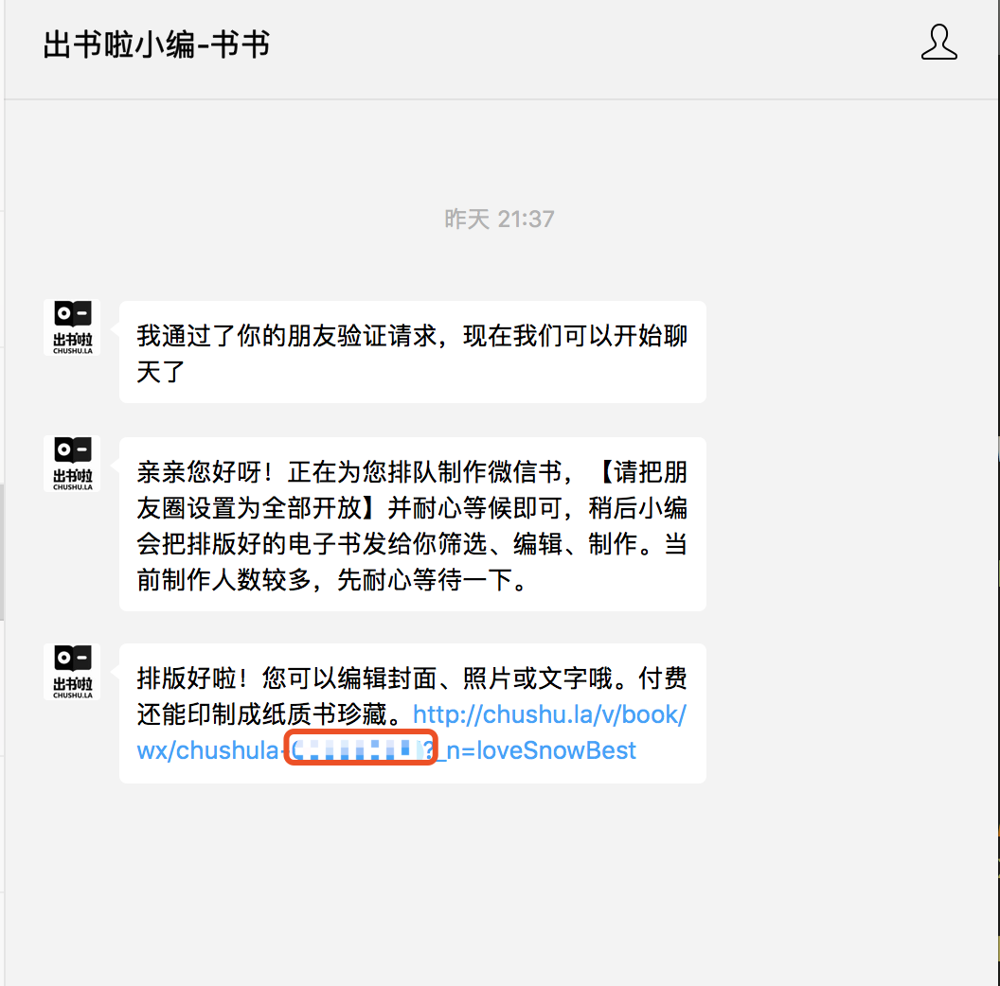
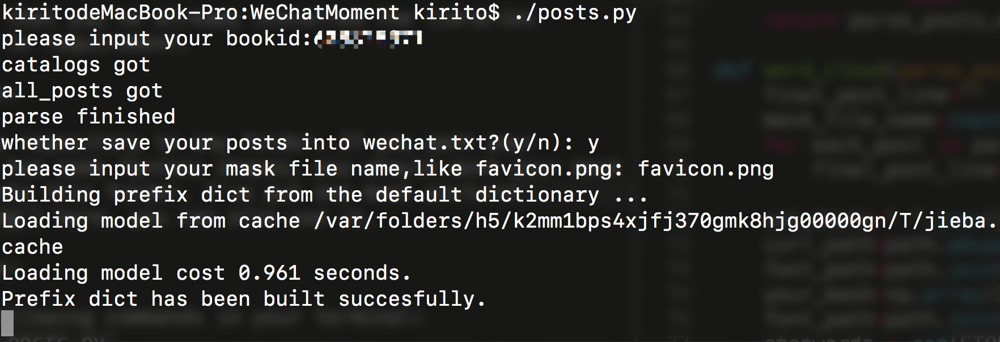

# WeChat Moments WordCloud

## Intro

This simple tool uses your wechat moments to generate wordCloud. You can have your own weChat moment WordCloud like this:  

## Requirement

- `pip3 install requests`  
- `pip3 install PIL`
- `pip3 install jieba`
- `pip3 intall matplotlib`
- `pip3 install wordcloud`
- <a href="http://chushu.la">出书啦</a>  

## How to Use  

**Step 1**: 

follow wechat public user: 出书啦, then it will give you a url:  

All you need to do is to recite the list of numbers in the red rectangle, which is the bookid we need to input afterwards.  

**Step 2**:  

Make sure that you've already installed the libraries mentioned in requirement.

**Step 3**:  

Clone this repository to any folder. If you want your wordcloud has some fantasy shapes, you should move your mask picture into this folder. I've put one mask picture(`favicon.png`) here, you can also use it.  

**Step 4**:

Run the following commands in your terminal:  
`chmod +x posts.py`
`./posts.py`

Then just input your information based on the tips printed on the terminal.

  

## Thanks

- 出书啦-微信公众号
- <a href="http://www.cnblogs.com/sheng-jie/p/7776495.html">爬取朋友圈，Get年度关键词</a>